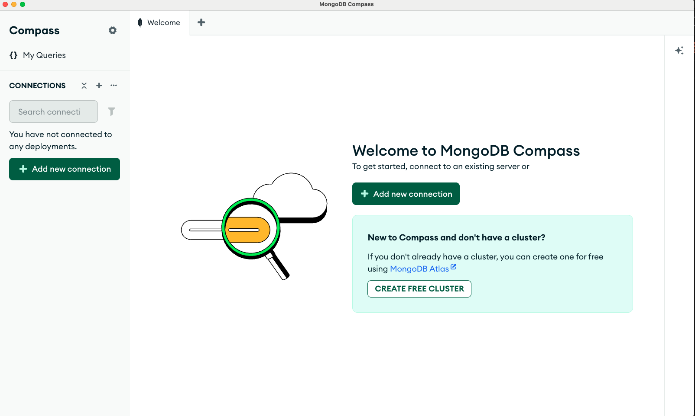

1. Open Compass

 2. Click on the Green Button 3. Click save and connect
 4. See the success message at the bottom of the screen

## Troubleshooting

- Make sure your server is running in the background for your service, on mac or linux you may have missed
  a setup step, double check the docs or ask in the questions channel
