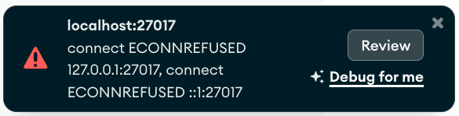

## Start app
1. 
```bash
npm install
```
2. 
```bash
npm run dev 
```
to test mongoose > mongodb database

## Troubleshooting


### ECONNREFUSED

#### In Terminal - ECONNREFUSED- No connection error 
 - in the terminal after runninng  npm run dev (30 second timeout)- "MongoNetworkError: connect ECONNREFUSED ::1:27017, connect ECONNREFUSED 127.0.0.1:27017"
 

#### Compass - ECONNREFUSED- No connection error 
 - Try to connect on Compass


#### How to fix
- Make sure you start your service so that mongodb is running

### Cant Find DB
- do npm install